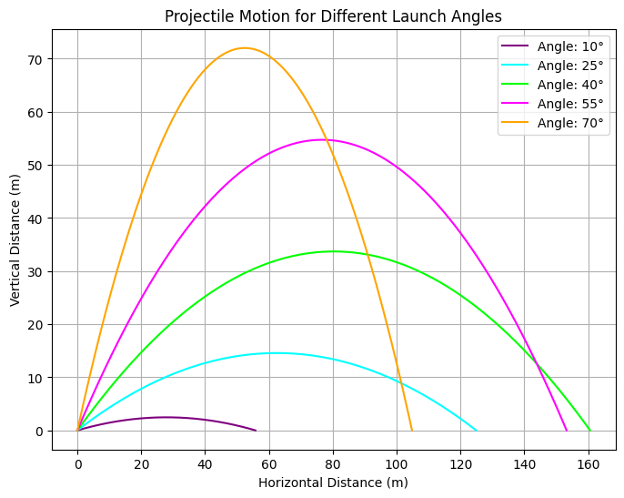

# Problem 1

# Investigating the Range as a Function of the Angle of Projection

## Deriving the Governing Equations of Motion

Projectile motion can be described by breaking the motion into horizontal and vertical components, governed by Newton's laws and the influence of gravity.

## Horizontal Motion:

In the absence of horizontal forces (air resistance is neglected), the horizontal velocity remains constant: 
## $$ v_x=v_0 \cos(\theta)$$

From this formula we could express horizontal position as a function of time:

## $$x(t)=v_0 \cos(\theta)t$$

## Here are some differential equations for horizontal motion:

1. #### Constant Velocity:

   $$\frac{d^2 x}{dt^2} = 0$$

2. #### Motion with Constant Acceleration:

   $$\frac{d^2 x}{dt^2} = a$$

3. #### Motion with Air Resistance (Proportional to Velocity):

   $$m \frac{d^2 x}{dt^2} = -k \frac{dx}{dt}$$

4. #### Projectile Motion (Horizontal Component):

   $$\frac{d^2 x}{dt^2} = 0$$

## Vertical motion:

The vertical velocity is affected by gravity:

 $${\large v_y(t)=v_0 \sin(\theta)-gt}$$

The vertical position is:

$${\large y(t)=v_0\sin(\theta)t-\frac{1}{2}gt^2}$$

### Here are some differential equations for vertical motion:

1. #### Free Fall (No Air Resistance):

   $$\frac{d^2 y}{dt^2} = -g$$

2. #### Motion with Constant Acceleration (Upward or Downward):

   $$\frac{d^2 y}{dt^2} = a$$

3. #### Motion with Air Resistance (Proportional to the Square of Velocity): 

   $$m \frac{d^2 y}{dt^2} = -mg - k \left( \frac{dy}{dt} \right)^2$$

4. #### Projectile Motion (Vertical Component):

   $$\frac{d^2 y}{dt^2} = -g$$

## Analasys of the range:

### Dependence of Range on Angle of Projection  

The range ($ R $) of a projectile is the total horizontal distance it covers before returning to the initial vertical level. Using kinematic equations and assuming air resistance is negligible, the range is given by:  

$$R = \frac{v_0^2 \sin(2\theta)}{g}$$

From this equation, we observe that:  

- The range depends on the sine of twice the launch angle ($ 2\theta $).  
- It reaches its **maximum value** when $ \sin(2\theta) = 1 $, which occurs at $ \theta = 45^\circ $.  
- At **0° and 90°**, $ \sin(2\theta) = 0 $, resulting in no horizontal range.  

### Impact of Other Parameters on the Range  

#### 1. Effect of Initial Velocity ($ v_0 $) 
- The range is **proportional to the square** of the initial velocity ($ v_0^2 $).  
- Increasing $ v_0 $ leads to a significantly larger range, while decreasing $ v_0 $ reduces the distance traveled.  
- Example: Doubling $ v_0 $ results in a fourfold increase in range.  

#### 2. Influence of Gravitational Acceleration ($ g $)
- Since $ g $ appears in the denominator, a **higher gravitational acceleration** results in a **shorter range**.  
- In environments with lower gravity (e.g., the Moon), the projectile travels much farther.  
- Example: The same projectile launched on Earth and on the Moon (where $ g_{\text{Moon}} \approx \frac{1}{6} g_{\text{Earth}} $) would cover **six times the range** on the Moon.

###Here is a projection

[Открыть в Google Colab](https://colab.research.google.com/drive/1JHPUWgxSt2TDCQFSSGbUghf_WDlvIvPt#scrollTo=vkCIj7YxY8HU)

