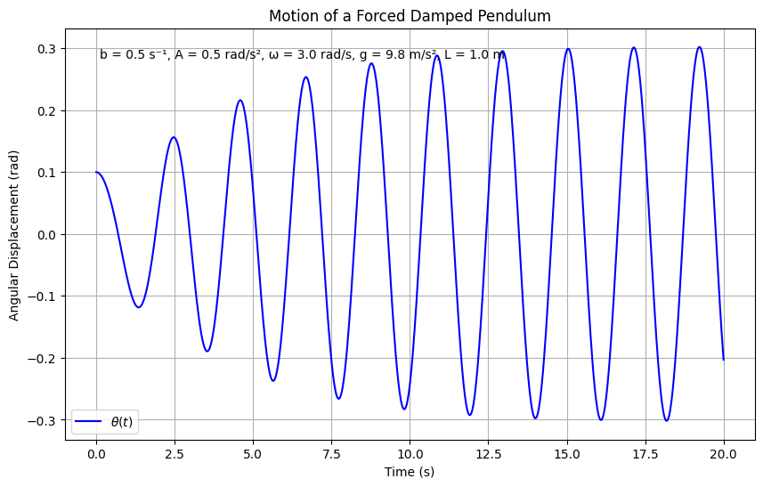
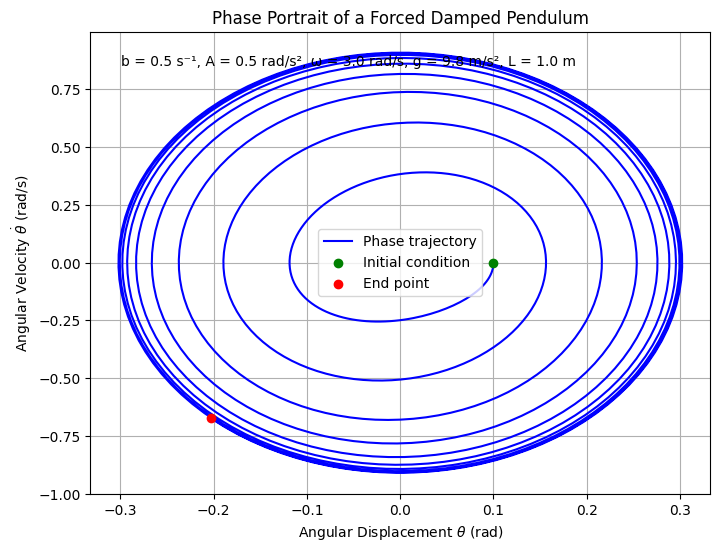
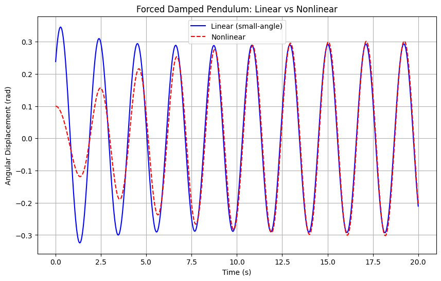
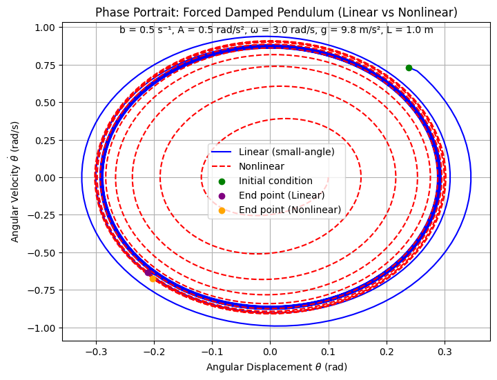
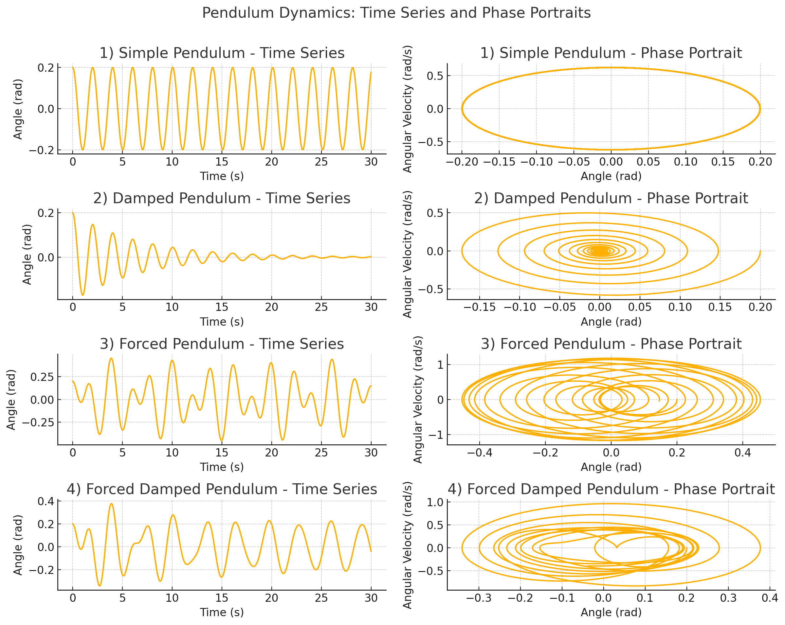

# Problem 2

# Investigating the Dynamics of a Forced Damped Pendulum

##  Start with the Differential Equation

The given equation for the motion of a forced damped pendulum is:

$$
\frac{d^2\theta}{dt^2} + b \frac{d\theta}{dt} + \frac{g}{L} \sin\theta = A \cos(\omega t)
$$

Here's what each term represents:

- **$\theta$**: The angular displacement of the pendulum from the vertical (in radians).
- **$\frac{d^2\theta}{dt^2}$**: The angular acceleration.
- **$b \frac{d\theta}{dt}$**: The damping term, where $b$ is the damping coefficient (friction or resistance).
- **$\frac{g}{L} \sin\theta$**: The gravitational restoring force, where $g$ is the acceleration due to gravity, $L$ is the length of the pendulum, and $\sin\theta$ accounts for the nonlinear restoring force.
- **$A \cos(\omega t)$**: The external forcing term, with amplitude $A$ and angular frequency $\omega$.

##  Derive the Approximate Solutions for Small-Angle Oscillations

For small angles, approximate $\sin\theta \approx \theta$. The given equation:

$$
\frac{d^2\theta}{dt^2} + b \frac{d\theta}{dt} + \frac{g}{L} \sin\theta = A \cos(\omega t)
$$

becomes a linear equation:

$$
\ddot{\theta} + b \dot{\theta} + \omega_0^2 \theta = A \cos(\omega t)
$$

where $\omega_0 = \sqrt{\frac{g}{L}}$ is the natural frequency.

### Solving the Equation

The solution is the sum of the homogeneous ($\theta_h$) and particular ($\theta_p$) solutions.

#### Homogeneous Solution

Solve the homogeneous part: $\ddot{\theta} + b \dot{\theta} + \omega_0^2 \theta = 0$. The characteristic equation is $r^2 + b r + \omega_0^2 = 0$, with roots $r = \frac{-b \pm \sqrt{b^2 - 4\omega_0^2}}{2}$. For the underdamped case ($b^2 < 4\omega_0^2$), the solution is:

$$
\theta_h(t) = e^{-\frac{b}{2}t} \left( C_1 \cos(\omega_d t) + C_2 \sin(\omega_d t) \right)
$$

where $\omega_d = \sqrt{\omega_0^2 - \frac{b^2}{4}}$. This part decays over time due to damping.

#### Particular Solution

For the forcing term $A \cos(\omega t)$, assume $\theta_p(t) = B \cos(\omega t) + C \sin(\omega t)$. Substitute into the equation, equate coefficients of $\cos(\omega t)$ and $\sin(\omega t)$, and solve:

$$
B (\omega_0^2 - \omega^2) + C (b \omega) = A, \quad -B (b \omega) + C (\omega_0^2 - \omega^2) = 0
$$

Solving gives:

$$
B = A \frac{\omega_0^2 - \omega^2}{(\omega_0^2 - \omega^2)^2 + (b \omega)^2}, \quad C = A \frac{b \omega}{(\omega_0^2 - \omega^2)^2 + (b \omega)^2}
$$

Rewrite as $\theta_p(t) = D \cos(\omega t - \phi)$, where:

$$
D = \frac{A}{\sqrt{(\omega_0^2 - \omega^2)^2 + (b \omega)^2}}, \quad \tan \phi = \frac{b \omega}{\omega_0^2 - \omega^2}
$$

#### General Solution

The full solution is:

$$
\theta(t) = e^{-\frac{b}{2}t} \left( C_1 \cos(\omega_d t) + C_2 \sin(\omega_d t) \right) + \frac{A}{\sqrt{(\omega_0^2 - \omega^2)^2 + (b \omega)^2}} \cos(\omega t - \phi)
$$

The homogeneous part decays, leaving the steady-state solution $\theta_p(t)$.

---

This plot directly visualizes your derived solution, showing the transient (decaying) and steady-state (oscillatory) components.
## Resonance and Energy in a Forced Damped Pendulum

In a **forced damped pendulum** (small-angle approximation), **resonance** governs long-term behavior and energy dynamics.

### Resonance Condition

Resonance arises when the **driving frequency** $\omega$ matches the **natural frequency** $\omega_0$ of the undamped system:

$$
\omega_0 = \sqrt{\frac{g}{L}}
$$

In a **damped** system, the peak response occurs slightly **below** the natural frequency:

$$
\omega_{\text{res}} = \sqrt{\omega_0^2 - \frac{b^2}{2}}
$$

---

### Amplitude at Resonance

The amplitude $D(\omega)$ of the steady-state oscillation is:

$$
D(\omega) = \frac{A}{\sqrt{(\omega_0^2 - \omega^2)^2 + (b \omega)^2}}
$$

At resonance:

$$
D_{\text{max}} \approx \frac{A}{b \omega_0} \quad \text{(when } b \ll \omega_0 \text{)}
$$

 **Lower damping** ($b$ small) → **Higher amplitude** near resonance.

---

### Energy Implications

#### 1. Energy Input vs Dissipation
- The **external force** supplies energy continuously.
- **Damping** dissipates it (e.g., via friction).
- In **steady state**, energy input equals energy loss.

#### 2. Energy Stored in Oscillations

Total energy (approximate):

$$
E(t) = \frac{1}{2} I \dot{\theta}^2 + \frac{1}{2} I \omega_0^2 \theta^2
$$

Substitute $\theta(t) = D \cos(\omega t - \phi)$:

$$
E(t) = \frac{1}{2} I \omega^2 D^2 \sin^2(\omega t - \phi) + \frac{1}{2} I \omega_0^2 D^2 \cos^2(\omega t - \phi)
$$

Average energy over a period $T = \frac{2\pi}{\omega}$:

$$
\langle E \rangle = \frac{1}{4} I D^2 (\omega^2 + \omega_0^2)
$$

→ **Maximum average energy** occurs near resonance, where $D$ is largest.

---

### Practical Impacts

- **Large oscillations** near resonance can be dangerous (e.g., bridges, machines).
- Engineers use **controlled damping** to:
  - Avoid resonance disasters
  - Tune systems that benefit from resonance (e.g., musical instruments).

---

### Summary

- Resonance: $\omega \approx \omega_0$
- At resonance:
  - **Amplitude** and **average energy** peak
  - Risk increases if damping is **too low**
- In steady state:
  - **Energy in = Energy out**

---

