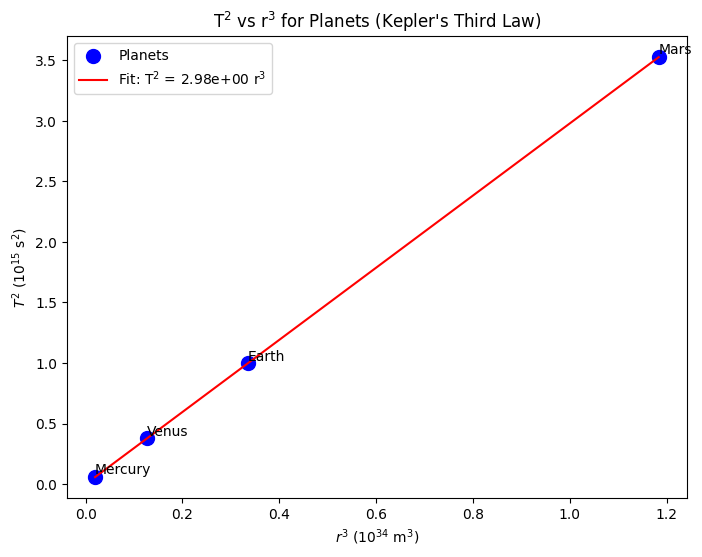
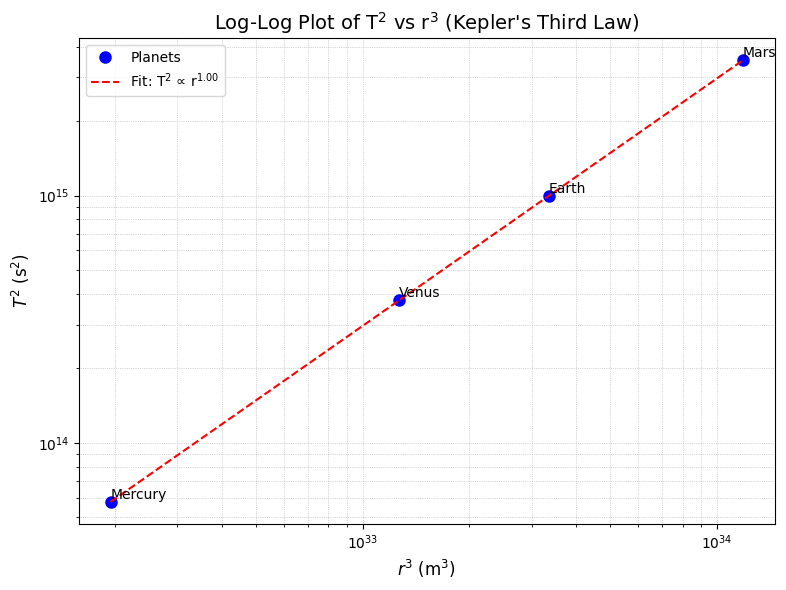

# Problem 1
# Orbital Period and Orbital Radius
## Derivation of $T^2 \propto r^3$ for Circular Orbits

To derive the relationship between the square of the orbital period ($T^2$) and the cube of the orbital radius ($r^3$) for a circular orbit:

1. ### Gravitational and Centripetal Forces:  
   The gravitational force equals the centripetal force for a satellite of mass $m$ orbiting a body of mass $M$:  

$\frac{G M m}{r^2} = \frac{m v^2}{r}$.  

   Cancel $m$ and multiply by $r$:

$\frac{G M}{r} = v^2$.

2. ### Orbital Velocity:  
   The velocity is:  

    $v = \frac{2 \pi r}{T}, \quad v^2 = \frac{4 \pi^2 r^2}{T^2}$.

3. ### Solve for $T^2$:  
   Substitute $v^2$:  
   
    $\frac{G M}{r} = \frac{4 \pi^2 r^2}{T^2}$.  
   Rearrange:  

    $T^2 = \frac{4 \pi^2 r^3}{G M}$.

## Final Relationship:  
### $T^2 = \frac{4 \pi^2}{G M} r^3$,  
or $T^2 \propto r^3$, where $T$ is the period, $r$ is the radius, $G$ is the gravitational constant, and $M$ is the central mass.

### The relationship between orbital period ($T$) and orbital radius ($r$, or semi-major axis $a$), described by Kepler's Third Law ($T^2 \propto a^3$), is crucial in astronomy.

**Implications:**

* **Calculating Masses:** By measuring $T$ and $a$ (or $r$) of an orbiting body, we can determine the mass ($M$) of the central body:

    $M \approx \frac{4\pi^2 a^3}{GT^2}$

    And vice-versa (if a satellite orbits a planet).

* **Determining Distances:** Knowing the central body's mass and the orbital period allows us to calculate the orbital radius:

    $a^3 \approx \frac{GMT^2}{4\pi^2}$

    This is essential for mapping star systems and determining exoplanet distances.

* **Understanding Orbital Dynamics:** This relationship helps predict orbits, study their stability, and infer properties of exoplanetary systems, including planetary migration and interactions.

---

## $T^2 \propto r^3$ Analysis
### Moon’s Orbit

## Moon's Orbit

**Parameters:**

**Earth to Moon:**
$r = 3.844 \times 10^{8}, \text{m}.$

**Moon:**
$T = 2.36 \times 10^{6}, \text{s}.$

**Earth:**
$M = 5.972 \times 10^{24}, \text{kg}.$

$G = 6.674 \times 10^{-11}, \text{m}^{3}\text{kg}^{-1}\text{s}^{-2}$.

**Verification:**

$r^{3} = 5.676 \times 10^{25}, \text{m}^{3}$.

Observed $T^{2} \approx 5.570 \times 10^{12}, \text{s}^{2}$.

$(4 \pi^{2} \approx 39.478)$

$G M = 3.986 \times 10^{14}, \text{m}^{3}\text{s}^{-2}$.

Expected $T^{2}$:

$T^{2} = \frac{39.478 \times 5.676 \times 10^{25}}{3.986 \times 10^{14}} \approx 5.622 \times 10^{12}, \text{s}^{2}$.

**Comparison:**
- Calculated $T^{2} \approx 5.622 \times 10^{12}, \text{s}^{2}$.
- Observed $T^{2} \approx 5.570 \times 10^{12}, \text{s}^{2}$.

The difference (approximately 1%) may be due to the Moon’s slightly elliptical orbit or minor variations in the input data, but it is within an acceptable range for this approximation.

**Application:**

$M \approx \left( \frac{4 \pi^{2} r^{3}}{G T^{2}} \right)$

$M \approx 5.998 \times 10^{24}, \text{kg} (Earth).$

This result is very close to Earth’s actual mass ($5.972 \times 10^{24}, \text{kg})$, confirming the validity of Kepler’s Third Law for the Moon’s orbit around Earth.

### Planetary Orbits

**Parameters:**

**Sun:**
 $M = 1.989 \times 10^{30} , \text{kg}$.

**Earth:** $r = 1.496 \times 10^{11} , \text{m}$, $T = 3.156 \times 10^7 , \text{s}$.

**Mars:** $r = 2.279 \times 10^{11} , \text{m}$, $T = 5.937 \times 10^7 , \text{s}$.

**Verification:**

**Earth:** $r^3 = 3.347 \times 10^{33} , \text{m}^3$, $T^2 \approx 9.962 \times 10^{14} , \text{s}^2$, 

**Observed:** $9.960 \times 10^{14} , \text{s}^2$.

**Mars:** $r^3 = 1.183 \times 10^{34} , \text{m}^3$, $T^2 \approx 3.519 \times 10^{15} , \text{s}^2$, 

**Observed:** $3.524 \times 10^{15} , \text{s}^2$.

**Application:** $r \approx \left( \frac{G M T^2}{4 \pi^2} \right)^{1/3} \approx 2.28 \times 10^{11} , \text{m} \text{(Mars)}.$

