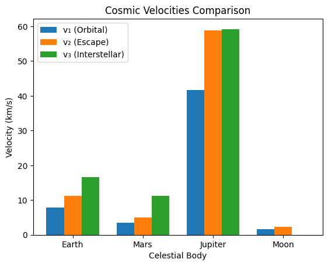
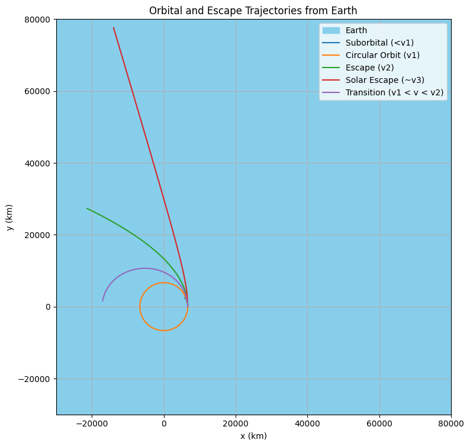

# Problem 2
## Escape Velocities and Cosmic Velocities

### 1. Definitions and Physical Meaning

- **First Cosmic Velocity ($v_1$)**: The orbital velocity required for an object to maintain a stable, circular low orbit around a celestial body, just above its surface (neglecting atmospheric drag). It is the speed needed to achieve a satellite orbit, balancing gravitational pull with centripetal force. For Earth, this is the speed for low Earth orbit (LEO) satellites.

- **Second Cosmic Velocity ($v_2$)**: The escape velocity required for an object to break free from a celestial body’s gravitational field, starting from its surface, and move to infinity without further propulsion. It represents the minimum speed to escape the planet’s gravity entirely, used for interplanetary missions.

- **Third Cosmic Velocity ($v_3$)**: The velocity required for an object, launched from a celestial body’s surface (e.g., Earth), to escape the gravitational influence of the central star (e.g., the Sun) and leave the star’s gravitational system (e.g., the Solar System). It is relevant for interstellar travel.

---

### 2. Mathematical Derivations

Below are the derivations for each cosmic velocity, based on fundamental physics principles (Newtonian gravity and conservation of energy).

---

#### First Cosmic Velocity ($v_1$)

The first cosmic velocity is the speed for a circular orbit near the surface of a celestial body. In a circular orbit, the gravitational force provides the centripetal force required for circular motion.

- **Gravitational force**:
  $$ F_g = \frac{GMm}{r^2} $$
  where $G$ is the gravitational constant ($6.67430 \times 10^{-11} \, \text{m}^3 \, \text{kg}^{-1} \, \text{s}^{-2}$), $M$ is the mass of the celestial body, $m$ is the mass of the orbiting object, and $r$ is the radius of the orbit (approximately the body’s radius for surface-level orbits).

- **Centripetal force** for circular motion:
  $$ F_c = \frac{mv_1^2}{r} $$
  where $v_1$ is the orbital velocity.

- Equate the forces:
  $$ \frac{GMm}{r^2} = \frac{mv_1^2}{r} $$

- Cancel $m$ (mass of the orbiting object) and simplify:
  $$ \frac{GM}{r^2} = \frac{v_1^2}{r} $$

- Multiply through by $r$:
  $$ \frac{GM}{r} = v_1^2 $$

- Solve for $v_1$:
  $$ v_1 = \sqrt{\frac{GM}{r}} $$

- Alternatively, express in terms of surface gravity $g = \frac{GM}{r^2}$, so $GM = gr^2$. Substitute:
  $$ v_1 = \sqrt{\frac{gr^2}{r}} = \sqrt{gr} $$

**Physical Insight**: $v_1$ depends on the celestial body’s mass and radius, reflecting the balance between gravity and orbital motion.

---

#### Second Cosmic Velocity ($v_2$)

The second cosmic velocity is the escape velocity, derived using conservation of mechanical energy. An object escaping to infinity has zero total mechanical energy at infinity (kinetic energy = 0, potential energy = 0).

- **Total mechanical energy** at the surface (initial state):
  - Kinetic energy: $$ K = \frac{1}{2} mv_2^2 $$
  - Gravitational potential energy: $$ U = -\frac{GMm}{r} $$
  - Total energy: $$ E_i = \frac{1}{2} mv_2^2 - \frac{GMm}{r} $$

- **At infinity** (final state, where $r \to \infty$):
  - Kinetic energy: $$ K = 0 $$ (velocity = 0 at infinity, minimum case)
  - Potential energy: $$ U = 0 $$ (since $U = -\frac{GMm}{r} \to 0$)
  - Total energy: $$ E_f = 0 $$

- Conservation of energy ($E_i = E_f$):
  $$ \frac{1}{2} mv_2^2 - \frac{GMm}{r} = 0 $$

- Cancel $m$ and simplify:
  $$ \frac{1}{2} v_2^2 = \frac{GM}{r} $$

- Multiply by 2:
  $$ v_2^2 = \frac{2GM}{r} $$

- Solve for $v_2$:
  $$ v_2 = \sqrt{\frac{2GM}{r}} $$

- Using $g = \frac{GM}{r^2}$, so $GM = gr^2$:
  $$ v_2 = \sqrt{\frac{2gr^2}{r}} = \sqrt{2gr} $$

- Relationship with $v_1$:
  $$ v_2 = \sqrt{2} \cdot v_1 $$

**Physical Insight**: Escape velocity is higher than orbital velocity, requiring enough energy to overcome the gravitational potential well.

---

#### Third Cosmic Velocity ($v_3$)

The third cosmic velocity is the speed required to escape the Sun’s gravitational influence, starting from the surface of a planet (e.g., Earth). This involves escaping the planet’s gravity and then achieving escape velocity from the Sun’s gravity at the planet’s orbital distance.

- **Step 1: Escape the planet’s gravity**:
  The object needs at least the second cosmic velocity ($v_2 = \sqrt{\frac{2GM_p}{r_p}}$) to escape the planet (mass $M_p$, radius $r_p$).

- **Step 2: Escape the Sun’s gravity**:
  At the planet’s orbital distance from the Sun ($R$, e.g., 1 AU for Earth), the object must achieve the escape velocity from the Sun’s gravitational field:
  $$ v_{\text{esc,Sun}} = \sqrt{\frac{2GM_s}{R}} $$
  where $M_s$ is the Sun’s mass ($1.989 \times 10^{30} \, \text{kg}$).

- **Orbital velocity of the planet**:
  The planet orbits the Sun at velocity $v_{\text{orb}}$, derived from circular orbit dynamics:
  $$ \frac{GM_s}{R^2} = \frac{v_{\text{orb}}^2}{R} \implies v_{\text{orb}}^2 = \frac{GM_s}{R} \implies v_{\text{orb}} = \sqrt{\frac{GM_s}{R}} $$

- **Total velocity required**:
  After escaping the planet, the object is at the planet’s orbital distance, moving at the planet’s orbital velocity $v_{\text{orb}}$. To escape the Sun, it needs an additional velocity to reach $v_{\text{esc,Sun}}$. The velocity relative to the Sun after escaping the planet is:
  $$ v_{\text{rel}} = \sqrt{v_2^2 + v_{\text{orb}}^2} $$

  However, the precise derivation for $v_3$ assumes the object must achieve $v_{\text{esc,Sun}}$ relative to the Sun. The additional velocity needed beyond $v_{\text{orb}}$:
  $$ v_{\text{add}} = v_{\text{esc,Sun}} - v_{\text{orb}} $$

- **Simplified $v_3$**:
  For Earth, the third cosmic velocity is often approximated by considering the total energy to escape both Earth and the Sun. A practical formula, accounting for Earth’s orbital velocity and escape requirements, is derived numerically or via energy considerations. The approximate formula for $v_3$ (from Earth’s surface to escape the Solar System) is:
  $$ v_3 \approx \sqrt{v_2^2 + (v_{\text{esc,Sun}} - v_{\text{orb}})^2} $$

  However, standard references provide:
  $$ v_3 \approx \sqrt{\frac{2GM_s}{R} + v_2^2} $$

This is complex, so we compute numerically below using known values.

**Physical Insight**: $v_3$ accounts for escaping two gravitational fields, making it significantly higher than $v_2$.

---

---

### 3. Calculations for Celestial Bodies

We calculate $v_1$, $v_2$, and $v_3$ for Earth, Mars, Jupiter, and the Moon using the derived formulas. Below are the parameters:

| **Body**  | **Mass ($M$, kg)** | **Radius ($r$, m)** | **Surface Gravity ($g$, m/s²)** | **Orbital Distance from Sun ($R$, m)** |
|-----------|--------------------|---------------------|---------------------------------|----------------------------------------|
| Earth     | $5.972 \times 10^{24}$ | $6.371 \times 10^6$ | 9.81                            | $1.496 \times 10^{11}$ (1 AU)           |
| Mars      | $6.417 \times 10^{23}$ | $3.389 \times 10^6$ | 3.71                            | $2.279 \times 10^{11}$                  |
| Jupiter   | $1.898 \times 10^{27}$ | $6.991 \times 10^7$ | 24.79                           | $7.785 \times 10^{11}$                  |
| Moon      | $7.346 \times 10^{22}$ | $1.737 \times 10^6$ | 1.62                            | (Orbit around Earth, not Sun)         |
| Sun       | $1.989 \times 10^{30}$ | -                   | -                               | -                                     |

### Earth

- **First Cosmic Velocity**:
  $$ v_1 = \sqrt{gr} = \sqrt{9.81 \cdot 6.371 \times 10^6} \approx \sqrt{6.25 \times 10^7} \approx 7.91 \, \text{km/s} $$

- **Second Cosmic Velocity**:
  $$ v_2 = \sqrt{2gr} = \sqrt{2 \cdot 9.81 \cdot 6.371 \times 10^6} \approx \sqrt{1.25 \times 10^8} \approx 11.19 \, \text{km/s} $$

- **Third Cosmic Velocity**:
  - Sun’s escape velocity at 1 AU:
    $$ v_{\text{esc,Sun}} = \sqrt{\frac{2GM_s}{R}} = \sqrt{\frac{2 \cdot 6.67430 \times 10^{-11} \cdot 1.989 \times 10^{30}}{1.496 \times 10^{11}}} \approx 42.1 \, \text{km/s} $$
  - Earth’s orbital velocity:
    $$ v_{\text{orb}} = \sqrt{\frac{GM_s}{R}} = \frac{42.1}{\sqrt{2}} \approx 29.8 \, \text{km/s} $$
  - Additional velocity needed:
    $$ v_{\text{add}} = 42.1 - 29.8 = 12.3 \, \text{km/s} $$
  - Total $v_3$:
    $$ v_3 \approx \sqrt{v_2^2 + v_{\text{add}}^2} = \sqrt{11.19^2 + 12.3^2} \approx \sqrt{125.2 + 151.3} \approx 16.6 \, \text{km/s} $$

---

### Mars

- **First Cosmic Velocity**:
  $$ v_1 = \sqrt{3.71 \cdot 3.389 \times 10^6} \approx \sqrt{1.257 \times 10^7} \approx 3.55 \, \text{km/s} $$

- **Second Cosmic Velocity**:
  $$ v_2 = \sqrt{2 \cdot 3.71 \cdot 3.389 \times 10^6} \approx \sqrt{2.514 \times 10^7} \approx 5.02 \, \text{km/s} $$

- **Third Cosmic Velocity**:
  - Sun’s escape velocity at Mars’ distance ($R = 2.279 \times 10^{11} \, \text{m}$):
    $$ v_{\text{esc,Sun}} = \sqrt{\frac{2 \cdot 6.67430 \times 10^{-11} \cdot 1.989 \times 10^{30}}{2.279 \times 10^{11}}} \approx 34.1 \, \text{km/s} $$
  - Mars’ orbital velocity:
    $$ v_{\text{orb}} = \sqrt{\frac{GM_s}{R}} \approx \frac{34.1}{\sqrt{2}} \approx 24.1 \, \text{km/s} $$
  - Additional velocity:
    $$ v_{\text{add}} = 34.1 - 24.1 = 10.0 \, \text{km/s} $$
  - Total $v_3$:
    $$ v_3 \approx \sqrt{5.02^2 + 10.0^2} \approx \sqrt{25.2 + 100} \approx 11.2 \, \text{km/s} $$

---

### Jupiter

- **First Cosmic Velocity**:
  $$ v_1 = \sqrt{24.79 \cdot 6.991 \times 10^7} \approx \sqrt{1.733 \times 10^9} \approx 41.6 \, \text{km/s} $$

- **Second Cosmic Velocity**:
  $$ v_2 = \sqrt{2 \cdot 24.79 \cdot 6.991 \times 10^7} \approx \sqrt{3.466 \times 10^9} \approx 58.9 \, \text{km/s} $$

- **Third Cosmic Velocity**:
  - Sun’s escape velocity at Jupiter’s distance ($R = 7.785 \times 10^{11} \, \text{m}$):
    $$ v_{\text{esc,Sun}} = \sqrt{\frac{2 \cdot 6.67430 \times 10^{-11} \cdot 1.989 \times 10^{30}}{7.785 \times 10^{11}}} \approx 18.5 \, \text{km/s} $$
  - Jupiter’s orbital velocity:
    $$ v_{\text{orb}} \approx \frac{18.5}{\sqrt{2}} \approx 13.1 \, \text{km/s} $$
  - Additional velocity:
    $$ v_{\text{add}} = 18.5 - 13.1 = 5.4 \, \text{km/s} $$
  - Total $v_3$:
    $$ v_3 \approx \sqrt{58.9^2 + 5.4^2} \approx \sqrt{3469 + 29.2} \approx 59.2 \, \text{km/s} $$

---

### Moon

- **First Cosmic Velocity**:
  $$ v_1 = \sqrt{1.62 \cdot 1.737 \times 10^6} \approx \sqrt{2.814 \times 10^6} \approx 1.68 \, \text{km/s} $$

- **Second Cosmic Velocity**:
  $$ v_2 = \sqrt{2 \cdot 1.62 \cdot 1.737 \times 10^6} \approx \sqrt{5.628 \times 10^6} \approx 2.37 \, \text{km/s} $$

- **Third Cosmic Velocity**: Not applicable, as the Moon orbits Earth, not the Sun directly. Escaping the Moon typically means entering Earth’s orbit or escaping Earth’s gravity, which aligns with Earth’s $v_3$.

---

## 4. Visualization and Data Comparison

Below is a table summarizing the cosmic velocities for Earth, Mars, Jupiter, and the Moon:

| **Body**  | **$v_1 (km/s)$** | **$v_2 (km/s)$** | **$v_3 (km/s)$** |
|-----------|------------------|------------------|------------------|
| Earth     | 7.91             | 11.19            | 16.6             |
| Mars      | 3.55             | 5.02             | 11.2             |
| Jupiter   | 41.6             | 58.9             | 59.2             |
| Moon      | 1.68             | 2.37             | N/A              |

