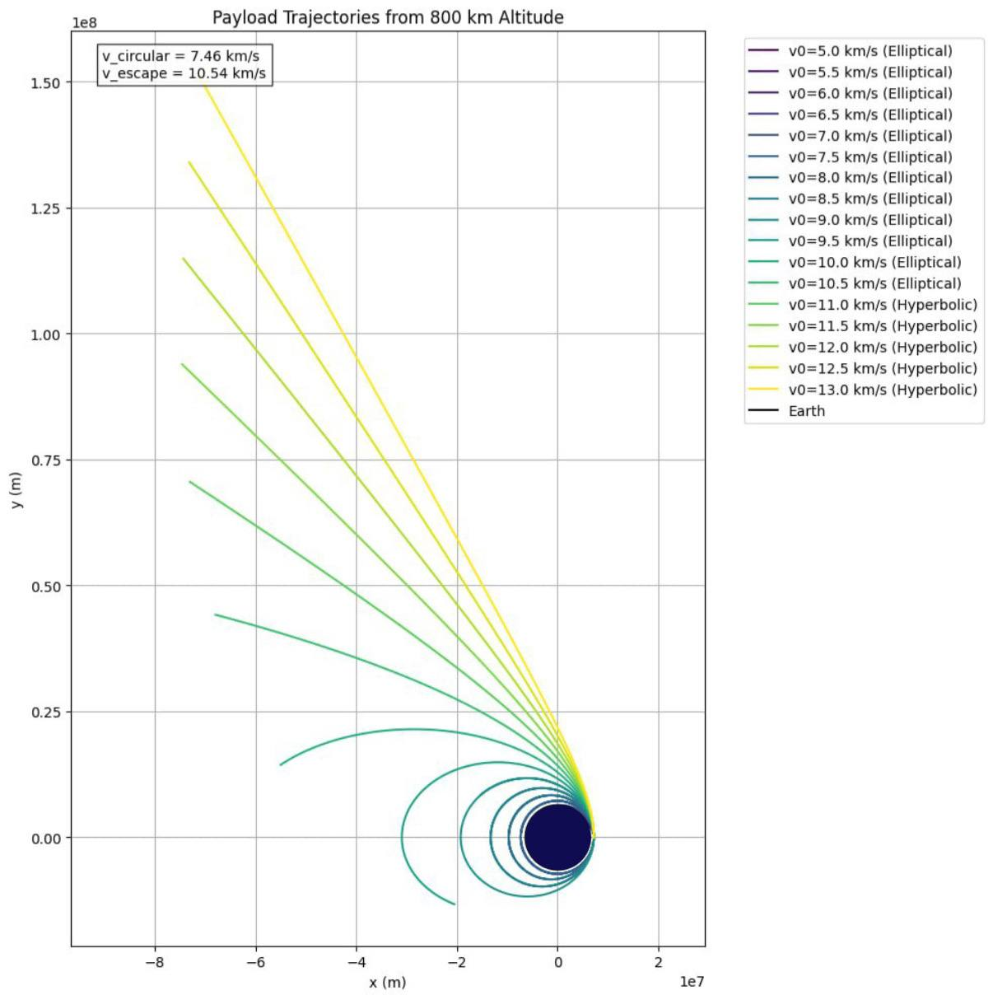
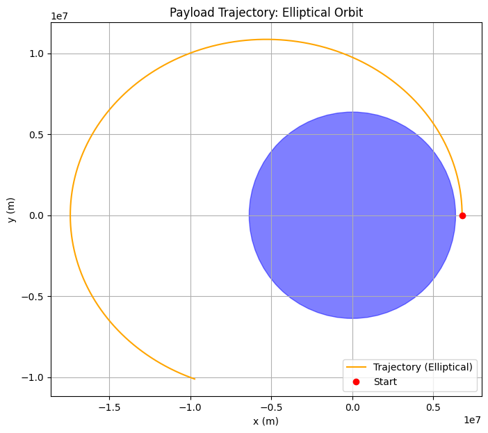

# Problem 3
# Trajectories of a Freely Released Payload Near Earth

The motion of a payload released near Earth (ignoring air resistance) follows one of the **conic section trajectories**—**circle**, **ellipse**, **parabola**, or **hyperbola**—depending on its **initial speed** relative to Earth and **direction**.

---

###  1. Circular Orbit
- **Condition**:  
  $v = v_{\text{circular}}$
- **Shape**:  
  Circle (special case of ellipse)
- **Energy**:  
  Total mechanical energy $E < 0$
- **Nature**:  
  Closed orbit, constant speed and altitude.
- **Example**:  
  Idealized geostationary satellite.

---

###  2. Elliptical Orbit
- **Condition**:  
  $v_{\text{circular}} < v < v_{\text{escape}}$
- **Shape**:  
  Ellipse
- **Energy**:  
  $E < 0$
- **Nature**:  
  Closed orbit, speed and altitude vary.
- **Examples**:  
  Low Earth Orbit (LEO), Medium Earth Orbit (MEO), Molniya orbit.

---

###  3. Parabolic Trajectory
- **Condition**:  
  $v = v_{\text{escape}}$
- **Shape**:  
  Parabola
- **Energy**:  
  $E = 0$
- **Nature**:  
  Marginal escape – object escapes Earth, reaching infinity with zero velocity.
- **Example**:  
  Theoretical boundary between bound and unbound motion.

---

###  4. Hyperbolic Trajectory
- **Condition**:  
  $v > v_{\text{escape}}$
- **Shape**:  
  Hyperbola
- **Energy**:  
  $E > 0$
- **Nature**:  
  Open trajectory – object escapes Earth’s gravity with residual velocity.
- **Examples**:  
  Interplanetary missions (e.g., Voyager, New Horizons after Earth flyby).

---

###  Summary Table

| **Trajectory**       | **Velocity Condition**                   | **Total Energy**   | **Orbit Type**     |
|----------------------|------------------------------------------|--------------------|---------------------|
| Circular             | $v = v_{\text{circular}}$                | $E < 0$            | Bound (closed)      |
| Elliptical           | $v_{\text{circular}} < v < v_{\text{escape}}$ | $E < 0$        | Bound (closed)      |
| Parabolic            | $v = v_{\text{escape}}$                  | $E = 0$            | Unbound (open)      |
| Hyperbolic           | $v > v_{\text{escape}}$                  | $E > 0$            | Unbound (open)      |

## Numerical Analysis of a Payload Trajectory Near Earth

This analysis computes the path of a payload released near Earth using Newtonian gravitational physics. We simulate the trajectory based on initial conditions using numerical integration techniques.

---

### Step 1: Define Constants and Initial Conditions

Let:

- Earth mass: $M = 5.972 \times 10^{24} \ \text{kg}$
- Gravitational constant: $G = 6.67430 \times 10^{-11} \ \text{N} \cdot \text{m}^2/\text{kg}^2$
- Earth radius: $R_e = 6.371 \times 10^6 \ \text{m}$
- Initial altitude: $h = 400 \times 10^3 \ \text{m}$ (Low Earth Orbit)
- Total initial radius: $R = R_e + h$

**Initial position and velocity:**

- $\vec{r}_0 = (R, 0)$
- $\vec{v}_0 = (0, v)$

**Reference velocities:**

- Circular orbit velocity: $v_{\text{circular}} = \sqrt{\frac{GM}{R}}$
- Escape velocity: $v_{\text{escape}} = \sqrt{2} \cdot v_{\text{circular}}$

---

### Step 2: Governing Equations

Using **Newton's Law of Gravitation** and **Newton's Second Law**, the equations of motion in 2D are:

$$
\vec{F} = -\frac{GMm}{r^2} \hat{r}
$$

$$
\vec{a} = \frac{\vec{F}}{m} = -\frac{GM}{r^3} \vec{r}
$$

In component form:

$$
\frac{d^2x}{dt^2} = -\frac{GMx}{(x^2 + y^2)^{3/2}}, \quad
\frac{d^2y}{dt^2} = -\frac{GMy}{(x^2 + y^2)^{3/2}}
$$

---

### Step 3: Numerical Integration (Runge-Kutta 4th Order)

To numerically solve these equations, we define:

Let:

- $\vec{r} = (x, y)$  
- $\vec{v} = (v_x, v_y)$

Convert to first-order ODEs:

$$
\frac{dx}{dt} = v_x, \quad
\frac{dy}{dt} = v_y
$$

$$
\frac{dv_x}{dt} = -\frac{GMx}{(x^2 + y^2)^{3/2}}, \quad
\frac{dv_y}{dt} = -\frac{GMy}{(x^2 + y^2)^{3/2}}
$$

These can be integrated using the Runge-Kutta 4th order method or Euler’s method.

---

### Step 4: Trajectory Classification

We compute total mechanical energy to classify the orbit:

### Total Energy

$$
E = \frac{1}{2}mv^2 - \frac{GMm}{r}
$$

- $E < 0$ → Elliptical orbit (bound)
- $E = 0$ → Parabolic escape
- $E > 0$ → Hyperbolic escape

### Eccentricity (Optional)

The trajectory's **eccentricity**:

$$
e = \sqrt{1 + \frac{2EL^2}{G^2M^2m^3}}
$$

Where $L = mrv_\perp$ is the angular momentum.

- $e < 1$ → Elliptical
- $e = 1$ → Parabolic
- $e > 1$ → Hyperbolic

---

---

### The trajectories—circular, elliptical, parabolic, and hyperbolic—dictate **orbital insertion**, **reentry**, and **escape scenarios** based on initial velocity and energy ($E = \frac{1}{2}mv^2 - \frac{GMm}{r}$).

- **Orbital Insertion**:
  - **Circular Orbit ($v = v_{\text{circular}}$, $E < 0$)**: Stable, constant-altitude orbit (e.g., geostationary satellites). Requires $v_{\text{circular}} \approx 7.67 \, \text{km/s}$ at 400 km altitude.
  - **Elliptical Orbit ($v_{\text{circular}} < v < v_{\text{escape}}$, $E < 0$)**: Bound orbit with varying altitude (e.g., LEO, GPS satellites). Achieved via precise burns, often using transfer orbits.
  - **Process**: Velocity adjustments ensure $E < 0$, $e < 1$.

- **Reentry**:
  - **Circular/Elliptical Orbits**: Starts bound ($E < 0$). A retro-burn ($\Delta v \approx 100-200 \, \text{m/s}$) lowers perigee into the atmosphere (e.g., Crew Dragon).
  - **Parabolic/Hyperbolic Trajectories ($E \geq 0$)**: Rare, often uncontrolled (e.g., meteoroids, Stardust capsule).
  - **Process**: Energy loss via burns or drag shifts trajectory to descent.

- **Escape Scenarios**:
  - **Parabolic Trajectory ($v = v_{\text{escape}}$, $E = 0$)**: Marginal escape, zero velocity at infinity. Theoretical minimum.
  - **Hyperbolic Trajectory ($v > v_{\text{escape}}$, $E > 0$)**: Unbound, with residual velocity (e.g., Voyager). Needs $\Delta v \approx 3.2 \, \text{km/s}$ from LEO.
  - **Process**: Burns or gravitational assists achieve $E \geq 0$, $e \geq 1$.

**Relation**: Energy and eccentricity ($e = \sqrt{1 + \frac{2EL^2}{G^2M^2m^3}}$) classify trajectories:
- Insertion: $E < 0$, $e < 1$ (bound).
- Reentry: Bound, energy reduced for atmospheric entry.
- Escape: $E \geq 0$, $e \geq 1$ (unbound).
Numerical integration (e.g., Runge-Kutta) ensures precise trajectory prediction.

---

**Circular**, **elliptical**, **parabolic**, and **hyperbolic** trajectories, driven by velocity and energy ($E = \frac{1}{2}mv^2 - \frac{GMm}{r}$), enable **space mission planning**, **satellite deployment**, and **planetary exploration**. Numerical integration ensures accuracy.

---

## Real-world applications

### 1. Space Mission Planning
Optimizes trajectories for **insertion**, **reentry**, or **escape**.
- **Circular ($v = v_{\text{circular}}$, $E < 0$)**: Stable orbits (e.g., geostationary, $v \approx 3.07 \, \text{km/s}$). Precise burns.
- **Elliptical ($v_{\text{circular}} < v < v_{\text{escape}}$, $E < 0$)**: Variable orbits (e.g., GPS). Hohmann transfers, $e < 1$.
- **Hyperbolic ($v > v_{\text{escape}}$, $E > 0$)**: Escapes (e.g., New Horizons, $v > 11.2 \, \text{km/s}$). Uses flybys.

---

### 2. Satellite Deployment
Places satellites in **circular** or **elliptical** orbits.
- **Circular**: LEO (e.g., Starlink, $v \approx 7.6 \, \text{km/s}$). Burn-circularized, $e \approx 0$.
- **Elliptical**: Specialized (e.g., Molniya). Transfer orbits, debris avoidance.

---

### 3. Planetary Exploration
**Elliptical** for departure, **hyperbolic** for travel, **circular/elliptical** for arrival.
- **Elliptical**: Parking orbits (e.g., Perseverance). Low $\Delta v$.
- **Hyperbolic**: Interplanetary (e.g., Voyager, $e > 1$). Flybys, corrections.
- **Circular/Elliptical**: Target orbits (e.g., Juno at Jupiter). Burns/aerobraking.

---

### Summary
- **Planning**: Circular for stability, elliptical for transfers, hyperbolic for escapes.
- **Deployment**: Circular LEO, elliptical specialized.
- **Exploration**: Elliptical to hyperbolic to target orbits.
Uses $\vec{a} = -\frac{GM}{r^3}\vec{r}$, $E$, $e = \sqrt{1 + \frac{2EL^2}{G^2M^2m^3}}$, numerical precision.
