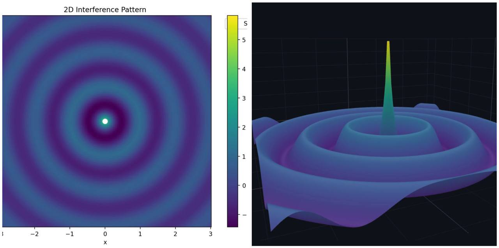
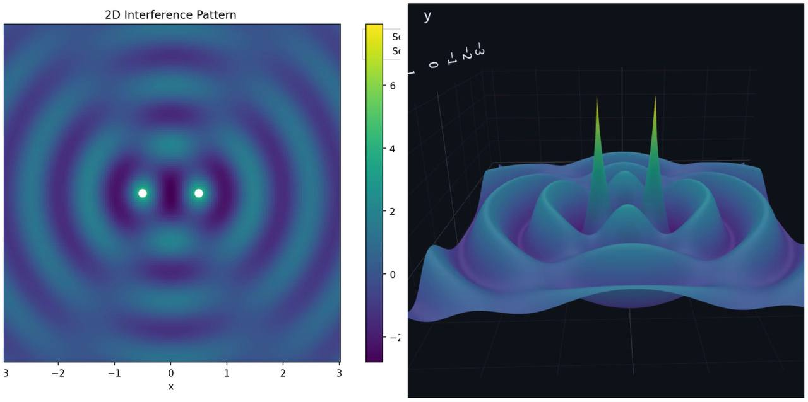
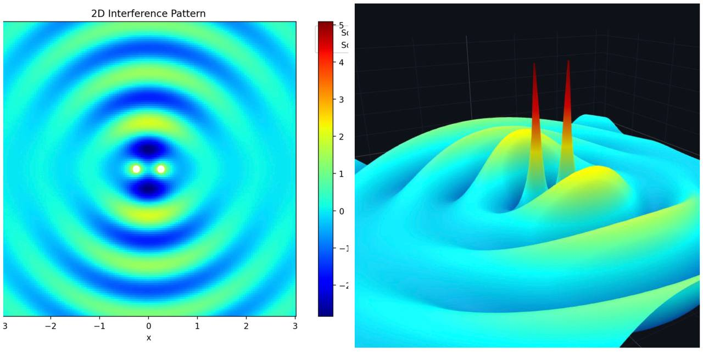
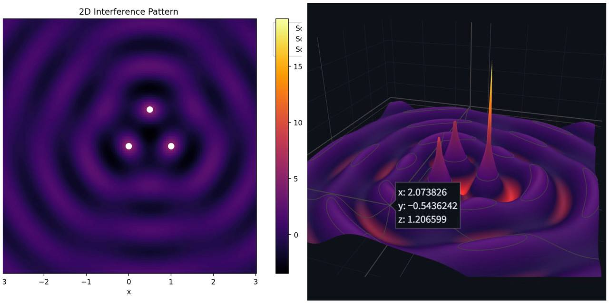
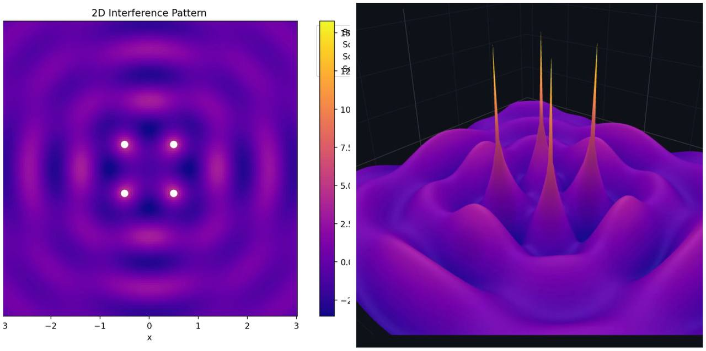
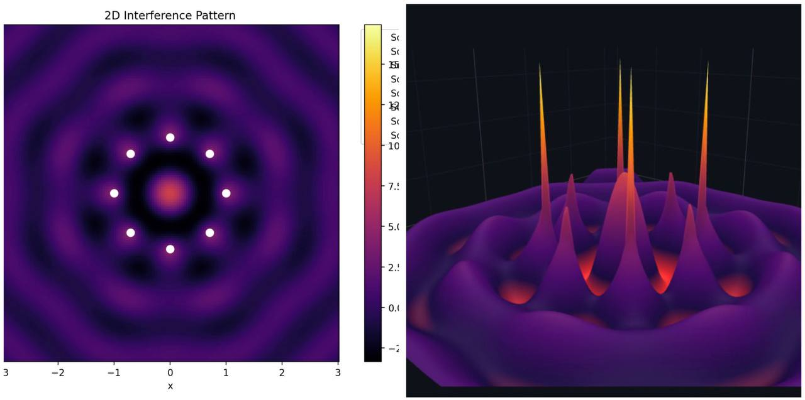

# Problem 1
# Interference Patterns on a water surface
### Step 1: Select a Regular Polygon
We choose an **equilateral triangle** with side length $a$. Place the triangle in the $xy$-plane with its vertices at:
- Vertex 1: $(x_1, y_1) = (0, 0)$
- Vertex 2: $(x_2, y_2) = (a, 0)$
- Vertex 3: $(x_3, y_3) = \left( \frac{a}{2}, \frac{a\sqrt{3}}{2} \right)$

These coordinates ensure the triangle is equilateral, as the distances between vertices are all equal to $a$.

---

### Step 2: Position the Sources
The point wave sources are placed at the vertices of the triangle:
- Source 1 at $(0, 0)$
- Source 2 at $(a, 0)$
- Source 3 at $\left( \frac{a}{2}, \frac{a\sqrt{3}}{2} \right)$

---

### Step 3: Wave Equations
Each source emits a circular wave described by the given equation:
$$
\eta(x, y, t) = \frac{A}{\sqrt{r}} \cdot \cos(kr - \omega t + \phi)
$$
where:
- $r = \sqrt{(x - x_i)^2 + (y - y_i)^2}$ is the distance from source $i$ at $(x_i, y_i)$ to point $(x, y)$.
- $A$, $k$, $\omega$, and $\phi$ are the same for all sources (same amplitude, wavelength, frequency, and initial phase).
- Assume $\phi = 0$ for simplicity, as the waves are coherent with a constant phase difference (which we can set to zero without loss of generality).

For each source:
- **Source 1 ($i=1$)**: $r_1 = \sqrt{x^2 + y^2}$
$$
\eta_1(x, y, t) = \frac{A}{\sqrt{r_1}} \cos(kr_1 - \omega t)
$$
- **Source 2 ($i=2$)**: $r_2 = \sqrt{(x - a)^2 + y^2}$
$$
\eta_2(x, y, t) = \frac{A}{\sqrt{r_2}} \cos(kr_2 - \omega t)
$$
- **Source 3 ($i=3$)**: $r_3 = \sqrt{\left(x - \frac{a}{2}\right)^2 + \left(y - \frac{a\sqrt{3}}{2}\right)^2}$
$$
\eta_3(x, y, t) = \frac{A}{\sqrt{r_3}} \cos(kr_3 - \omega t)
$$

---

### Step 4: Superposition of Waves
The total displacement at point $(x, y)$ and time $t$ is the sum of the displacements from all sources:
$$
\eta_{\text{sum}}(x, y, t) = \eta_1(x, y, t) + \eta_2(x, y, t) + \eta_3(x, y, t)
$$
$$
\eta_{\text{sum}}(x, y, t) = \sum_{i=1}^3 \frac{A}{\sqrt{r_i}} \cos(kr_i - \omega t)
$$

---

### Step 5: Analyze Interference Patterns
To identify constructive and destructive interference:
- **Constructive interference** occurs when the waves are in phase, i.e., the phase difference $k(r_i - r_j)$ is a multiple of $2\pi$, so $|r_i - r_j| = m\lambda$, where $m$ is an integer and $\lambda = \frac{2\pi}{k}$.
- **Destructive interference** occurs when the waves are out of phase by $\pi$, i.e., $|r_i - r_j| = (m + \frac{1}{2})\lambda$.

Since $r_i$ depends on the position $(x, y)$, we evaluate $\eta_{\text{sum}}$ over a grid of points. Set $t = 0$ for simplicity:
$$
\eta_{\text{sum}}(x, y, 0) = \sum_{i=1}^3 \frac{A}{\sqrt{r_i}} \cos(kr_i)
$$
The intensity is approximately $I \propto |\eta_{\text{sum}}|^2$, but we can plot $\eta_{\text{sum}}$ to see crests and troughs.

---

## Single Source:

## Two Sorces: 

## Double Slit:

## Triangle:

## Square:

## Circle(8 sources):

[link to the visualizations](https://replit.com/@shevcm5713825ae/WaveInterference)

