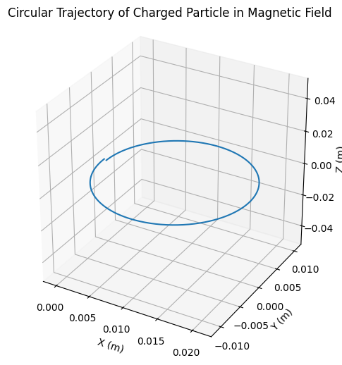
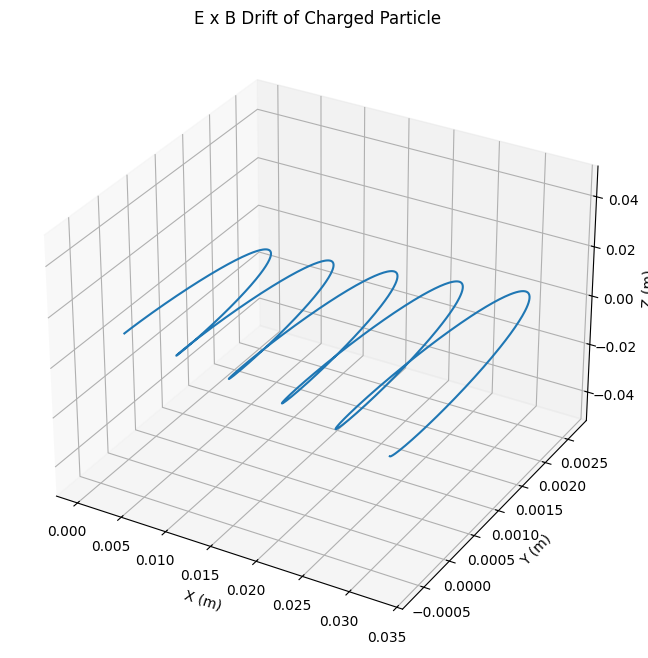
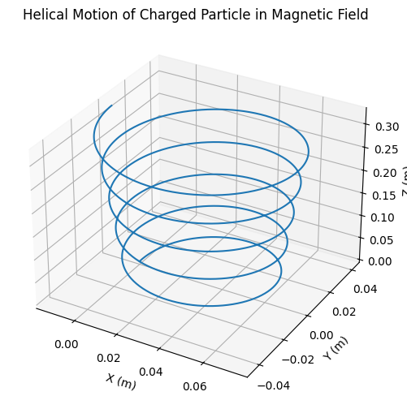

# Problem 1

## Lorentz Force
The Lorentz force is a fundamental concept in electromagnetism, describing the force experienced by a charged particle moving in both electric and magnetic fields. It is given by the equation:

$$\mathbf{F} = q(\mathbf{E} + \mathbf{v} \times \mathbf{B})$$

where:

* $\mathbf{F}$ is the Lorentz force
* $q$ is the charge of the particle
* $\mathbf{E}$ is the electric field
* $\mathbf{v}$ is the velocity of the particle
* $\mathbf{B}$ is the magnetic field
* $\times$ denotes the vector cross product

---

### Case 1: Only Electric Field Present

$$
\vec{F} = q\vec{E}
$$

- The force is in the direction of $( \vec{E} )$ (or opposite for negative charges).  
- The motion is **uniformly accelerated** in the direction of the electric field.

---

### Case 2: Only Magnetic Field Present

$$
\vec{F} = q(\vec{v} \times \vec{B})
$$

- The force is always **perpendicular** to the velocity.  
- This causes the particle to follow a **circular or helical** path.

#### Larmor Radius (Cyclotron Radius)

$$
r_L = \frac{mv_\perp}{qB}
$$

Where ($ v_\perp $) is the component of velocity perpendicular to the magnetic field.

#### Cyclotron Frequency

$$
\omega_c = \frac{qB}{m}
$$

#### Period of Circular Motion

$$
T = \frac{2\pi m}{qB}
$$

---

### Case 3: Crossed Electric and Magnetic Fields

When $( \vec{E} \perp \vec{B} )$, the particle exhibits a **drift motion**:

#### E × B Drift Velocity

$$
\vec{v}_d = \frac{\vec{E} \times \vec{B}}{B^2}
$$

- This drift is **independent of particle charge or mass**.  
- All charged particles experience the same drift direction and speed.

---

### General Motion: Arbitrary E and B Fields

Depending on the orientation of fields and velocity:

- **Circular motion** if $( \vec{v} \perp \vec{B} ), ( \vec{E} = 0 )$ 
- **Helical motion** if $( \vec{v} )$ has a component along $( \vec{B} )$  
- **Accelerated motion** along $( \vec{E} )$ if $( \vec{E} \parallel \vec{B} )$  
- **E × B Drift** if $( \vec{E} \perp \vec{B} )$  

---

### Numerical Methods for Solving the Equations of Motion

The motion of a charged particle under the Lorentz force is governed by:

$$
\frac{d\vec{v}}{dt} = \frac{q}{m}(\vec{E} + \vec{v} \times \vec{B}), \quad \frac{d\vec{r}}{dt} = \vec{v}
$$

To solve this system numerically, we discretize time into small intervals and approximate derivatives using finite differences. Two commonly used methods are:

---

### 1. Euler Method

The Euler method is the simplest numerical approach to integrate ordinary differential equations. It updates the velocity and position linearly using the derivative at the current time step:

$$
\vec{v}_{n+1} = \vec{v}_n + \frac{q}{m}(\vec{E} + \vec{v}_n \times \vec{B}) \, \Delta t
$$

$$
\vec{r}_{n+1} = \vec{r}_n + \vec{v}_n \, \Delta t
$$

- **Advantages:** Simple and easy to implement.  
- **Disadvantages:** Low accuracy; errors can accumulate quickly, especially in long simulations or rapidly changing fields.

---

### 2. Runge-Kutta Method (4th Order, RK4)

The Runge-Kutta 4th order method improves on the Euler method by evaluating the derivatives multiple times within each step and taking a weighted average. It provides significantly better accuracy, even with larger time steps.

For velocity and position updates:

$$
\vec{v}_{n+1} = \vec{v}_n + \frac{1}{6}(k_1 + 2k_2 + 2k_3 + k_4)
$$

$$
\vec{r}_{n+1} = \vec{r}_n + \frac{1}{6}(l_1 + 2l_2 + 2l_3 + l_4)
$$

## Exploration of Applications

The Lorentz force plays a crucial role in a wide range of physical systems and technologies:

### 1. Particle Accelerators
In devices such as **cyclotrons** and **synchrotrons**, charged particles are accelerated using electric fields and steered using magnetic fields. The magnetic component of the Lorentz force causes particles to travel in circular or spiral paths, allowing for repeated acceleration and high energy levels.

### 2. Mass Spectrometers
These instruments separate ions based on their mass-to-charge ratio. As ions move through a magnetic field, the Lorentz force deflects their path. Lighter ions are deflected more than heavier ones, allowing for identification based on the curvature of their trajectory.

### 3. Plasma Confinement (Fusion Reactors)
In magnetic confinement fusion devices like **tokamaks**, magnetic fields are used to control hot, ionized gases (plasmas). The Lorentz force acts on the charged particles in the plasma, guiding and containing them in complex magnetic field configurations to prevent contact with reactor walls.

---

## Relevance of Electric and Magnetic Fields

- **Electric Fields (E):** These are used to accelerate charged particles. A particle in an electric field experiences a force in the direction of the field (for positive charges) or opposite (for negative charges). This is essential for initiating and maintaining motion.

- **Magnetic Fields (B):** Magnetic fields influence the **direction** of motion rather than speed, due to the perpendicular nature of the **v × B** term. This results in circular or helical trajectories, enabling control over particle paths without necessarily altering their kinetic energy.

Together, electric and magnetic fields allow for precise manipulation of charged particles in both research and technology, from probing atomic structures to achieving nuclear fusion.

---

