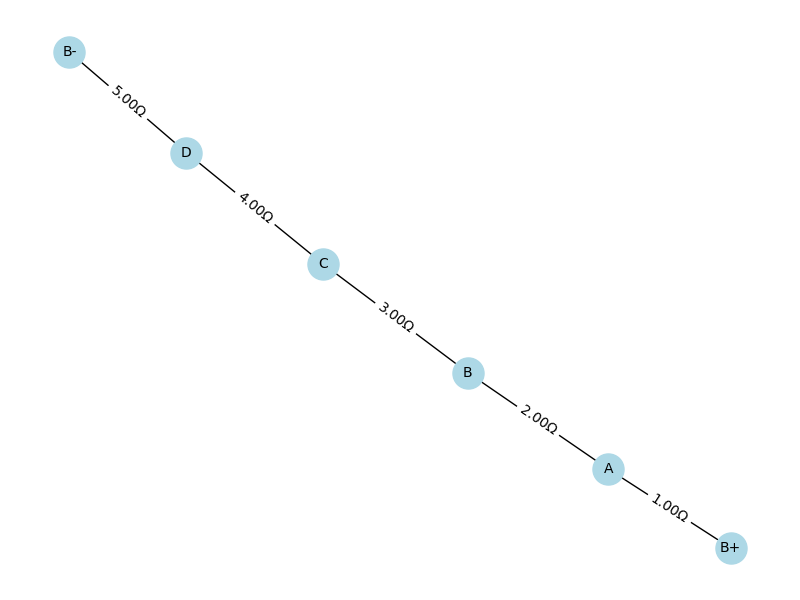
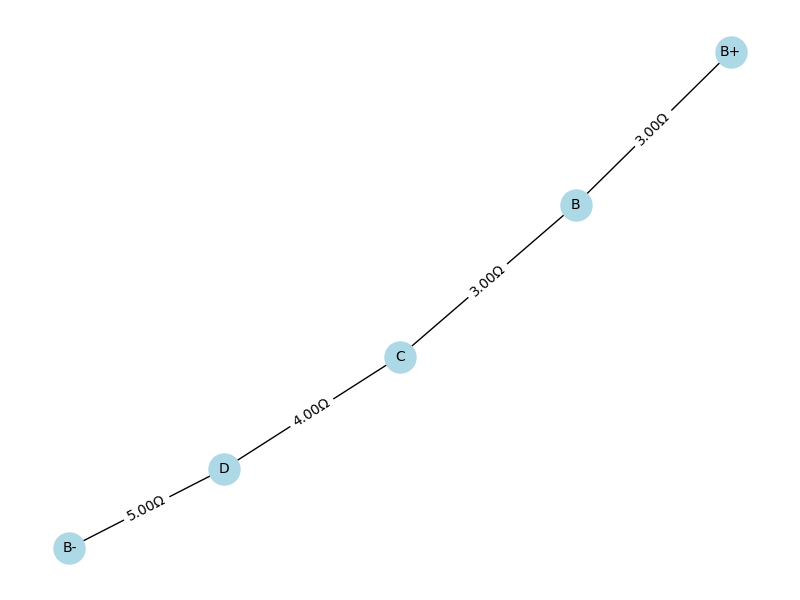
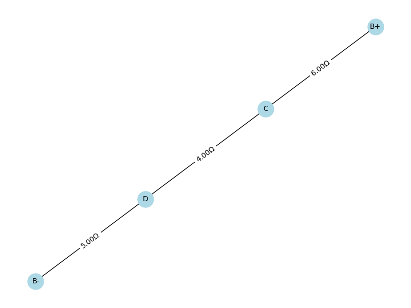
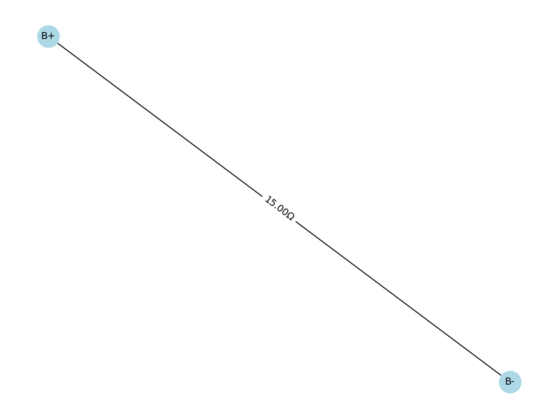
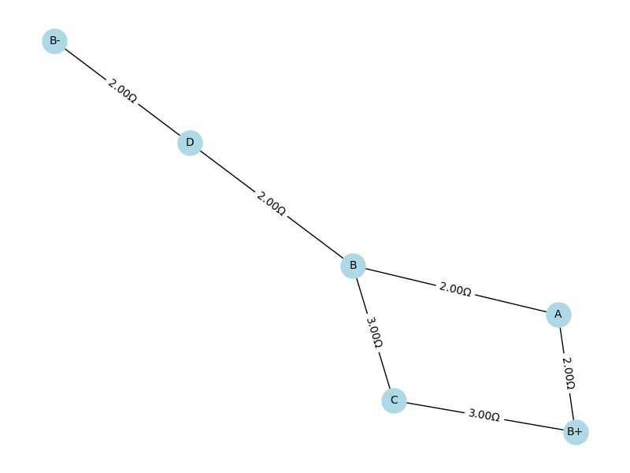
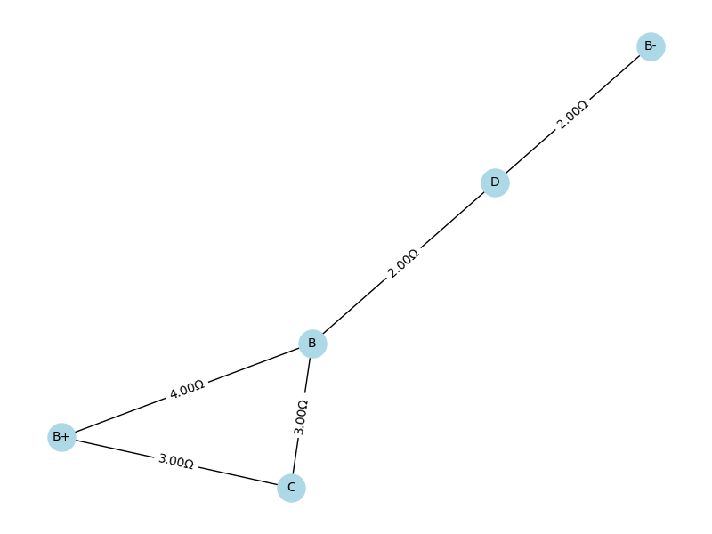
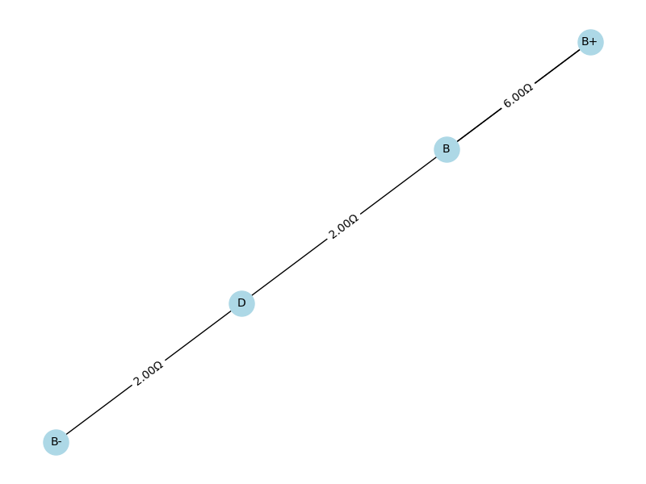
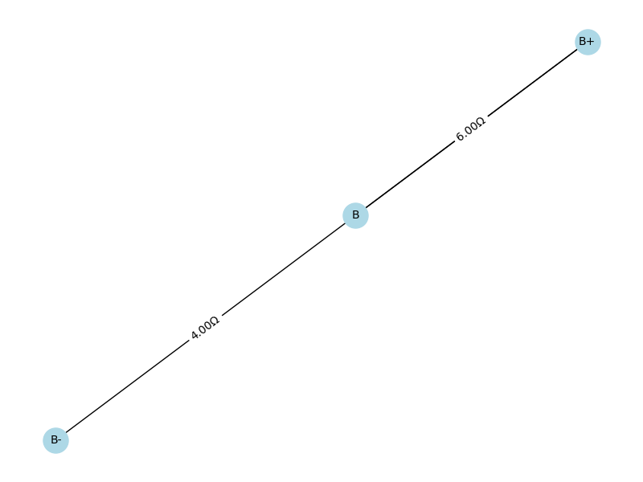
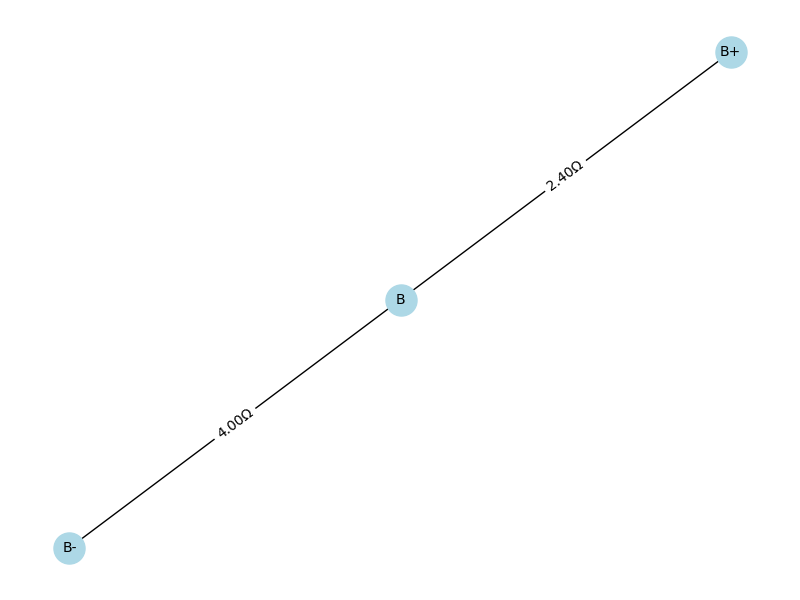
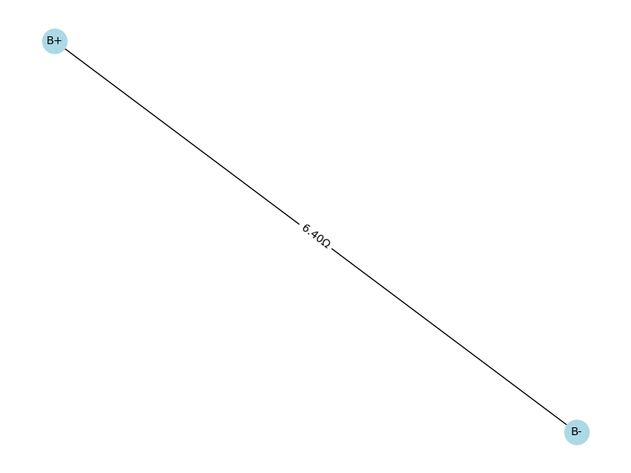

# Problem 1

## Theoretical Background: Circuit Simplification

### 1. **Resistors in Electrical Circuits**
Resistors are passive components that resist the flow of electric current, measured in ohms ($\Omega$). Circuit simplification reduces a complex resistor network into a single equivalent resistance ($R_{eq}$) between two terminals, facilitating analysis of current, voltage, or power.

### 2. **Series Circuits**
In a series circuit, resistors are connected end-to-end, forming a single current path. The equivalent resistance is the sum of individual resistances:

$$R_{eq} = R_1 + R_2 + R_3 + \dots + R_n$$

**Properties**:
- The same current flows through all resistors.
- The total voltage across the circuit is the sum of voltage drops across each resistor ($V = IR$, per Ohm's Law).
- Simplification involves adding resistances along the path.

### 3. **Parallel Circuits**
In a parallel circuit, resistors are connected across the same two nodes, sharing the same voltage. The equivalent resistance is calculated using:

$$\frac{1}{R_{eq}} = \frac{1}{R_1} + \frac{1}{R_2} + \frac{1}{R_3} + \dots + \frac{1}{R_n}$$

For two resistors, this simplifies to:

$$R_{eq} = \frac{R_1 \cdot R_2}{R_1 + R_2}$$

**Properties**:
- The voltage across each resistor is identical.
- The total current is the sum of currents through each branch.
- The equivalent resistance is always less than the smallest individual resistance.

### 4. **Series-Parallel Circuits**
Complex circuits combine series and parallel configurations. Simplification involves:
1. Identifying series or parallel subnetworks.
2. Combining series resistors by addition.
3. Combining parallel resistors using the reciprocal rule.
4. Repeating until a single $R_{eq}$ is obtained.

### 5. **Ohm's Law**
Ohm's Law ($V = IR$) is fundamental:
- In series, voltage divides proportionally to resistance.
- In parallel, current divides inversely proportional to resistance.
- The equivalent resistance enables calculation of total current or voltage.

### 6. **Practical Considerations**
- **Applications**: Simplified circuits aid in calculating total current, power ($P = I^2 R$), or designing circuits with specific properties.
- **Assumptions**: Simplification assumes ideal resistors with linear behavior and no frequency-dependent effects (e.g., in AC circuits).
- **Advanced Techniques**: For non-series-parallel networks, methods like Kirchhoff's Laws or Delta-Star transformations may be required.

## Series circuit:
### Initial circuit:

### Step 1:

## Step 2:

## Step 3:

## Step 4(final): 

###  Series Simplification Steps (Only Series Reduction)

**Step 1: B+ $\rightarrow$ A $\rightarrow$ B**  
- Resistors: $1\,\Omega + 2\,\Omega = 3\,\Omega$  
- New edge: B+ - $3\,\Omega$ - B

**Step 2: C $\rightarrow$ B $\rightarrow$ B+**  
- Resistors: $4\,\Omega + 2\,\Omega = 6\,\Omega$  
- New edge: C - $6\,\Omega$ - B+

**Step 3: D $\rightarrow$ C $\rightarrow$ B+**  
- Resistors: $4\,\Omega + 6\,\Omega = 10\,\Omega$  
- New edge: D - $10\,\Omega$ - B+

**Step 4: B- $\rightarrow$ D $\rightarrow$ B+**  
- Resistors: $5\,\Omega + 10\,\Omega = 15\,\Omega$  
- New edge: B- - $15\,\Omega$ - B+

---

###  Final Equivalent Resistance
- $R_{eq} = 15\,\Omega$ between B+ and B-
- 

[code](https://colab.research.google.com/drive/13HsKEdKk919xj-514BH52fEM19PC-6Vz#scrollTo=_pqcv7lMPbFz)

---

## Series-Parallel combination circuit:
### Initial circuit:

### Step 1:

### Step 2:

### Step 3:

### Step 4:

### Step 5(final):

## Resistor Simplification Steps Explanation

**Step 1: Series**
- Path: B+ $\rightarrow$ A $\rightarrow$ B  
- Resistors: 2 $\Omega$ + 2 $\Omega$ = 4 $\Omega$  
- Result: B+ -- 4 $\Omega$ -- B

**Step 2: Series**
- Path: B+ $\rightarrow$ C $\rightarrow$ B  
- Resistors: 3 $\Omega$ + 3 $\Omega$ = 6 $\Omega$  
- Result: B+ -- 6 $\Omega$ -- B

**Step 3: Series**
- Path: B $\rightarrow$ D $\rightarrow$ B-  
- Resistors: 2 $\Omega$ + 2 $\Omega$ = 4 $\Omega$  
- Result: B -- 4 $\Omega$ -- B-

**Step 4: Parallel**
- Between B+ and B: 4 $\Omega$ || 6 $\Omega$  
- Result:  
  $$\frac{1}{R} = \frac{1}{4} + \frac{1}{6} = \frac{5}{12} \Rightarrow R = \frac{12}{5} = 2.4\,\Omega$$

**Step 5: Series**
- Path: B+ $\rightarrow$ B $\rightarrow$ B-  
- Resistors: 2.4 $\Omega$ + 4 $\Omega$ = **6.4 $\Omega$**  
- Result: B+ -- 6.4 $\Omega$ -- B-

---

###  Final Equivalent Resistance:
$R_{eq} = 6.4\,\Omega$

[code](https://colab.research.google.com/drive/1bwCrJyg0eLxR719U-gCOGMW5FtXXqwfI)

