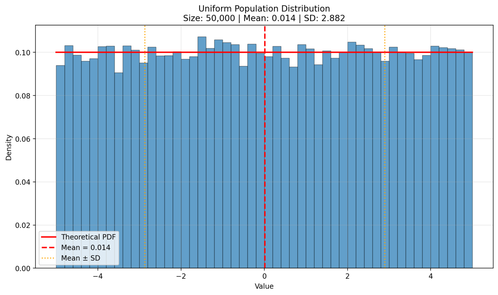
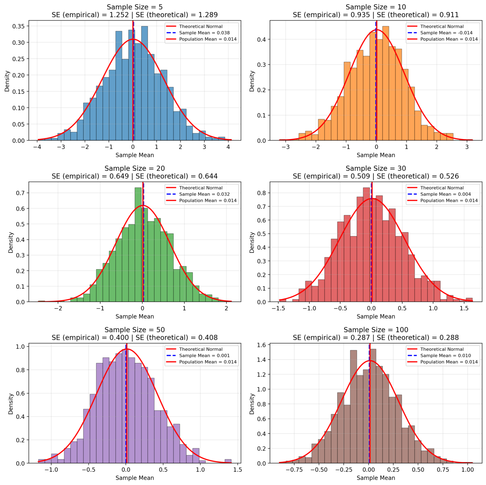
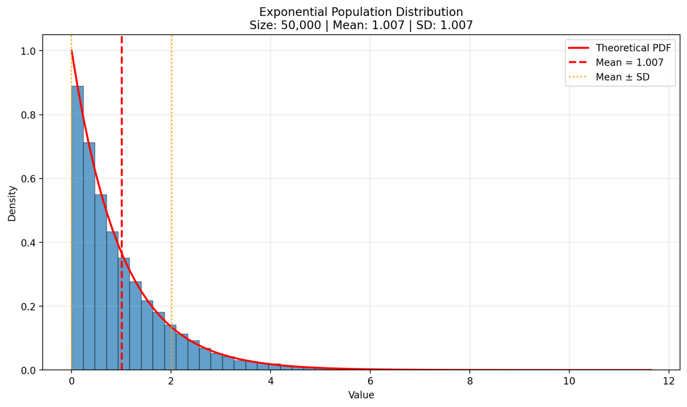
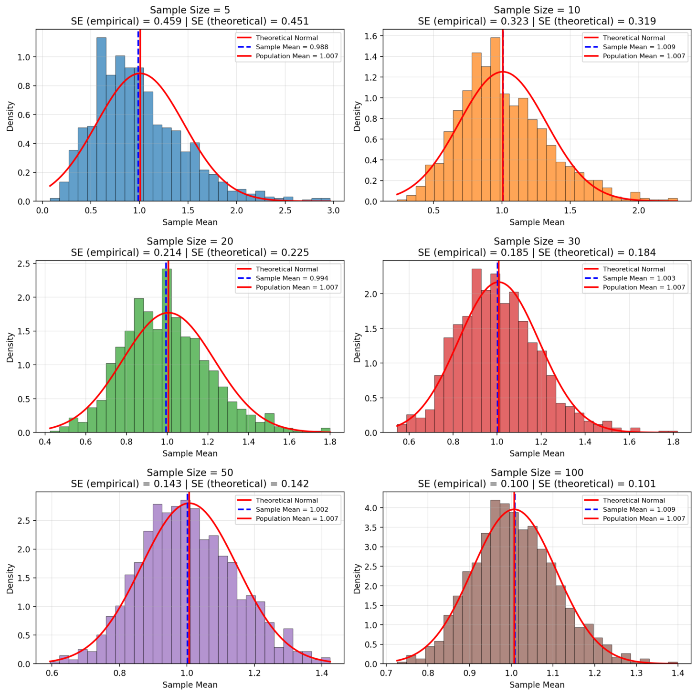
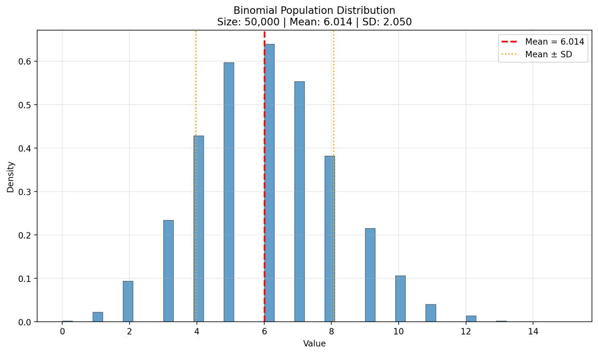
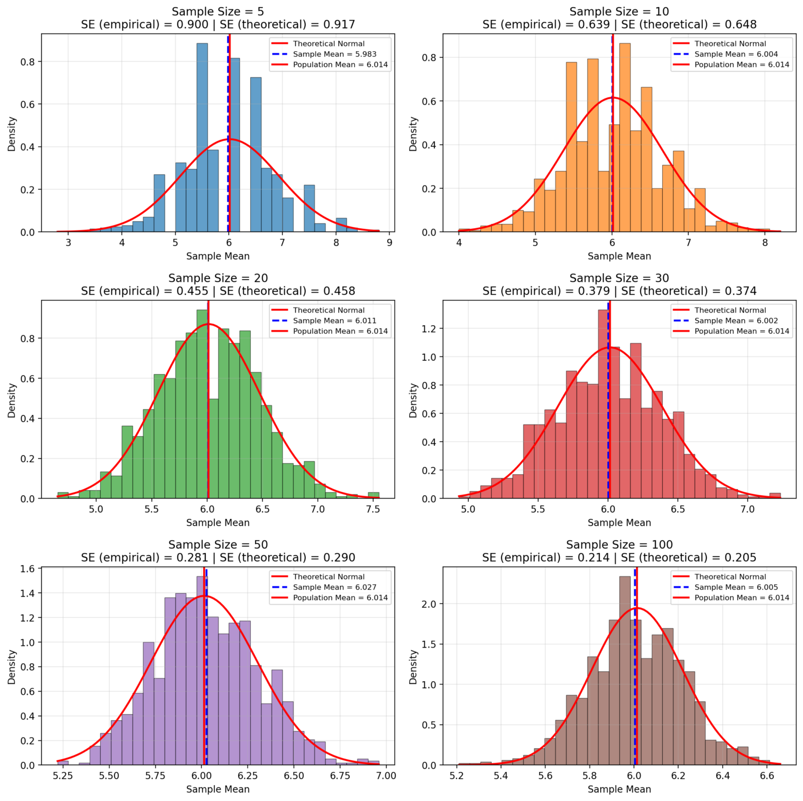
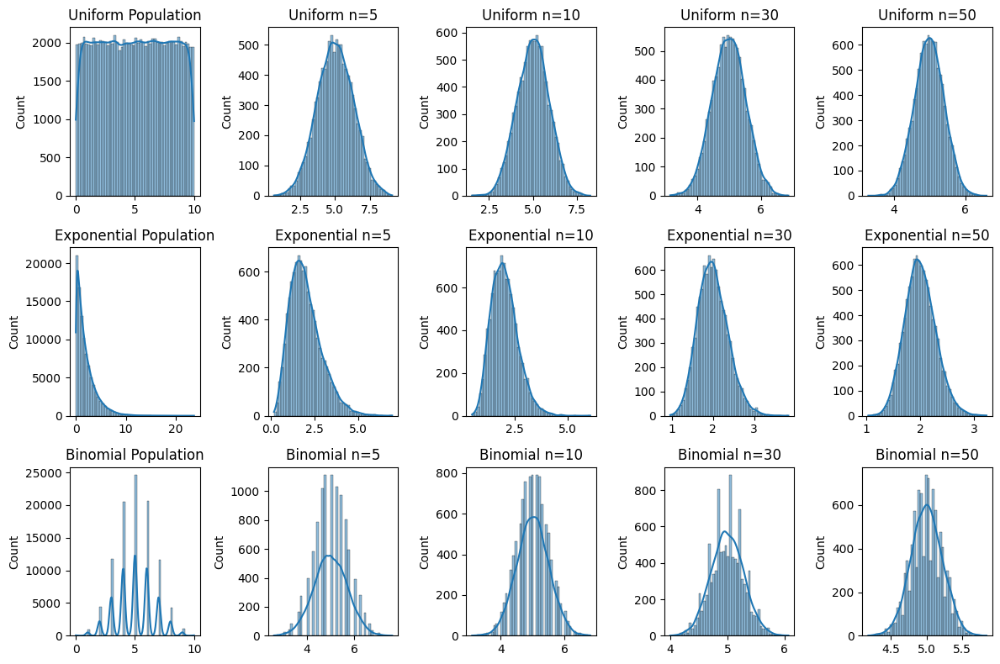

# Problem 1

# The Central Limit Theorem (CLT): The Core Idea

The **Central Limit Theorem (CLT)** is a fundamental principle in statistics. It states that if you take enough samples of a certain size from any population, the distribution of those sample means will tend to form a **normal (bell-shaped) distribution**. This holds true even if the original population data isn't normally distributed itself.

---

## Practical Applications

- **Estimating Population Parameters:**  
  It's the basis for constructing confidence intervals for population means, helping us estimate the true average of a large group based on a smaller sample.

- **Hypothesis Testing:**  
  Many statistical tests used to compare groups or make decisions about population parameters rely on the CLT to justify their assumptions about the distribution of test statistics.

- **Quality Control:**  
  Manufacturers use it to monitor product quality. By regularly sampling products, they can track the average measurements; if the sample mean deviates significantly, it signals a potential issue in production.

- **Financial Modeling:**  
  In finance, the aggregation of many random factors (like individual stock returns in a portfolio) often results in an overall outcome that can be approximated by a normal distribution, useful for risk assessment.

## Uniform

## Exponential

## Binomial

---

