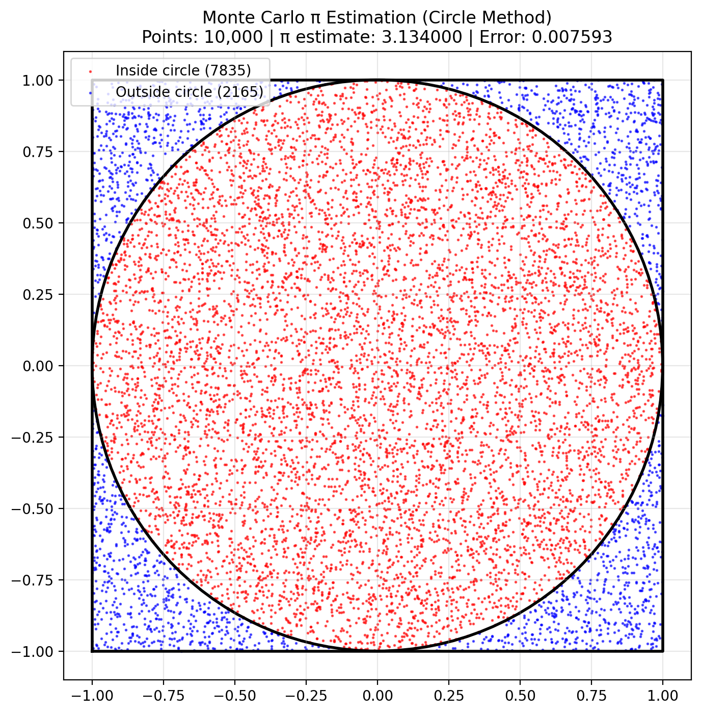
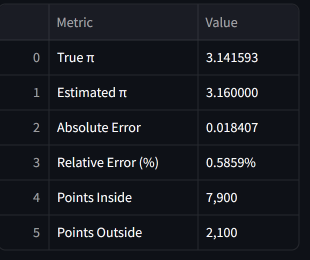
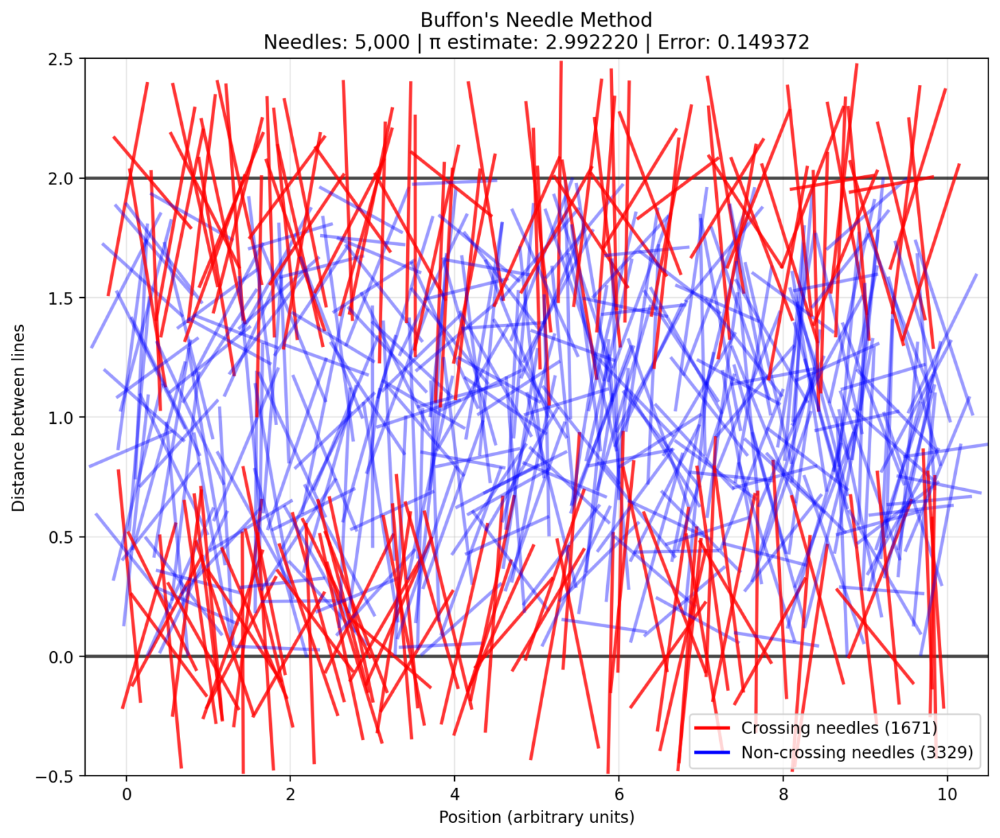
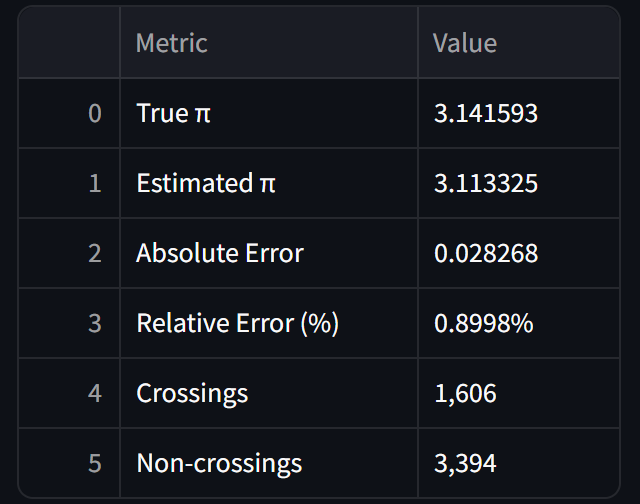
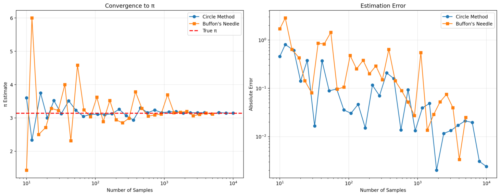

# Problem 2
## Estimating Pi using Monte Carlo Methods
### Circle Method Visualization:

### Understanding the Methods
**Circle Method Theory:**

***Geometric Principle:*** A unit circle inscribed in a 2×2 square has:

Circle area = π × 1² = π

Square area = 2 × 2 = 4

Ratio = π/4

***Monte Carlo Estimation:*** Generate random points in the square. 
 Count points inside the circle (x² + y² ≤ 1)
π ≈ 4 × (points inside / total points)

## Results:

###  Buffon's Needle Visualization:

### Understanding the Methods
#### Geometric Setup
- **Parallel Lines**: The plane has parallel lines separated by a distance of 2.0 units.
- **Needles**: Each needle has a length of 1.0 unit and is dropped randomly.
- **Randomization**: Each needle has a random position (center) and angle relative to the lines.

#### Crossing Probability
- A needle crosses a line if it spans across the line boundary.
- For a needle of length \( L \) and line separation \( d \), the theoretical probability of a needle crossing a line is:
  \[
  P = \frac{2L}{\pi d}
  \]
- In this setup: \( L = 1.0 \), \( d = 2.0 \), so:
  \[
  P = \frac{2 \times 1.0}{\pi \times 2.0} = \frac{1}{\pi}
  \]

#### π Estimation
- The value of π can be estimated using the formula:
  \[
  \pi \approx \frac{2 \times \text{needle length} \times \text{total drops}}{\text{line distance} \times \text{crossings}}
  \]
- For the current setup (\( L = 1.0 \), \( d = 2.0 \)):
  \[
  \pi \approx \frac{2 \times 1.0 \times n}{2.0 \times \text{crossings}} = \frac{n}{\text{crossings}}
  \]
- As the number of needle drops increases, the estimate converges to the true value of π.

## Results:

## Method Comparison:

## Convergence Analysis:
